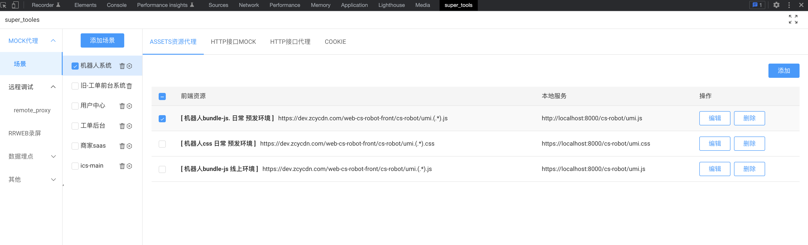
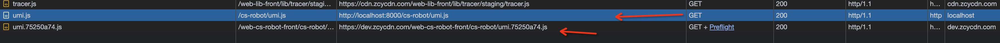
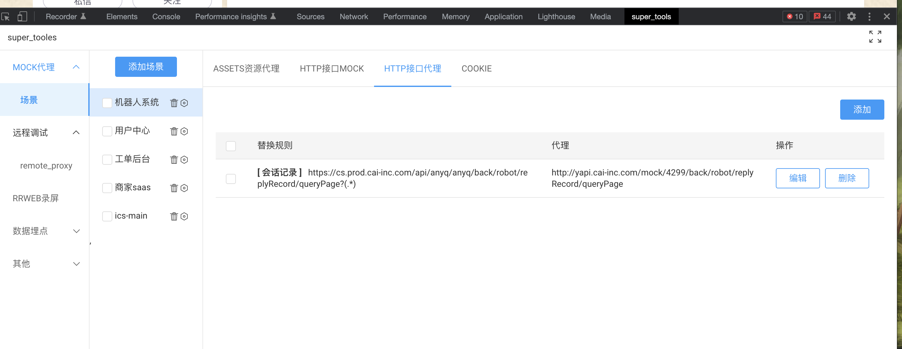

### 本地开发调试模式
 

 
 ```typescript
 npm run build:chrome_dev_host
 npm run start
```


 ### build打包

 ```typescript
  npm run build:chrome_pro 
```

手动配置规则

 ```typescript
window._forward.config = {
  proxy: new Map([
    [
      'https://dev.zcycdn.com/web-cs-robot-front/cs-robot/umi.(.*).js', // https://dev.zcycdn.com/web-cs-robot-front/cs-robot/umi.(.*).js
      'https://localhost:8000/cs-robot/umi.js', // http://127.0.0.1:3000/index.js
    ],
    [
      'https://dev.zcycdn.com/web-cs-robot-front/cs-robot/umi.(.*).css',
      'https://localhost:8000/cs-robot/umi.css', //
    ],
  ]),
};
```

## 📺 Screenshot
<p align="center">
    
</p>
<p align="center">
    
</p>

<p align="center">
    
</p>
### 帮助文档
帮助文档： https://www.yuque.com/luoxuan-nir7u/mdzc63/xcb176ahlhis78w4?singleDoc# 《supertools》
